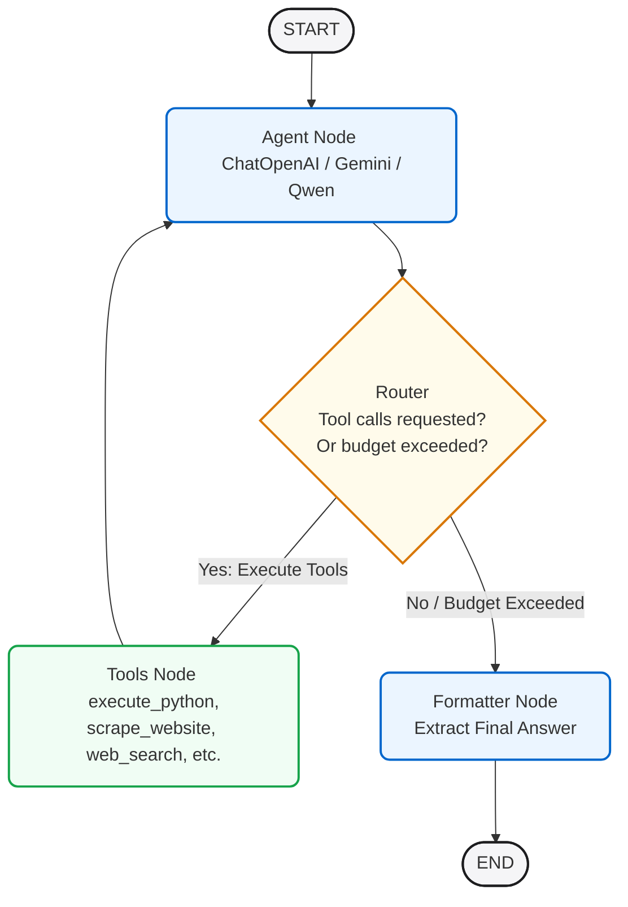

# 🥇 GAIA Benchmark Agent (LangGraph + Multi-Step Reasoning)

[](https://huggingface.co/spaces/zxpr27/gaia-agent)
[](https://huggingface.co/spaces/zxpr27/gaia-agent)
[](https://github.com/langchain-ai/langgraphjs)
[](#dynamic-model-pooling)

A robust, multi-step agent designed to solve the **GAIA (General AI Assistants) Benchmark** validation questions. Built using **LangGraph JS** for structured state orchestration, it leverages a dynamic pool of state-of-the-art LLMs (Gemini, GPT-4o, and Qwen-2.5) alongside a rich tool suite to perform RAG, web search, code execution, image analysis, and video parsing.

---

## 📐 System Architecture

The agent is modeled as a stateful cyclic graph using **LangGraph**. It continuously reasons, invokes appropriate tools, stores outcomes, and refines its approach in a structured loop until it either resolves the prompt or exhausts its computation budget.



### Flow Breakdown

1. **State Initialization**: The graph state is initialized with the question, the run parameters, and any optional file attachment paths.
2. **Agent Node**: Selects the best LLM from the model pool based on task characteristics (e.g. Gemini for multimodal tasks) and sends the query. It returns any tool call commands or direct responses.
3. **Conditional Router**:
   - If the LLM requests tool calls and the budget is under **6 rounds**, it routes to the **Tools Node**.
   - If no tools are requested or the budget is exceeded, it routes to the **Formatter Node** to conclude execution.
4. **Tools Node**: Executes all tool calls in parallel, clamps outputs (to protect context windows), and appends the result to the conversation state before looping back to the Agent Node.
5. **Formatter Node**: Extracts and standardizes the output to match the strict formatting required by the GAIA evaluation system.

---

## 🧠 Core Engine Mechanics

### Dynamic Model Pooling & Fallbacks
To ensure maximum availability and bypass rate limits, the agent manages a dynamic LLM pool:
* **Gemini 2.5 Flash**: The primary choice for multimodal tasks containing images or YouTube video links.
* **GPT-4o (via GitHub Models)**: The main text-based reasoning agent.
* **Qwen-2.5-72B-Instruct (via Hugging Face API)**: A robust fallback for complex tool-use scenarios.
* **Groq / Llama 3**: Fast backup reasoning node.

If a primary model encounters a quota/rate limit error (429), the graph automatically falls back to the next model in the pool to continue the task seamlessly.

### Robust Tool Suite
* 🐍 **Python Code Executor (`execute_python`)**: Executes python scripts in a sandbox environment. Fully equipped with `pdfplumber`, `openpyxl`, `pillow`, `pandas`, `beautifulsoup4`, and `duckduckgo-search` to handle complex binary file parsing, math, and data analysis.
* 🔍 **Web Search (`web_search`)**: Uses Gemini Google Search Grounding to fetch highly accurate and verified results, with a programmatic DuckDuckGo API fallback.
* 🌐 **Website Scraper (`scrape_website`)**: Scrapes target URLs into clean markdown using Firecrawl, with a basic request scraper as fallback.
* 📼 **Wayback Machine (`wayback_machine`)**: Resolves historical web page snapshots from `archive.org` for time-dependent questions.
* 📺 **YouTube Parser (`yt_transcript`)**: Fetches detailed transcripts or video metadata from YouTube links using `yt-dlp` or Gemini's direct audio-visual processing.
* 🖼️ **Image Analyzer (`analyze_image`)**: Employs multimodal vision capabilities (Gemini 2.5 Flash, GPT-4o, Qwen2-VL) to extract answers from chess diagrams, maps, charts, and diagrams.
* 🤗 **Hugging Face Hub tool (`huggingface_hub`)**: Inspects model, dataset, author, and download statistics directly from the HF Hub API.

---

## 📈 GAIA Benchmark Results

The agent achieved a score of **35.00%** on the validation questions.

| Metric | Value |
| :--- | :--- |
| **Total Tasks Attempted** | 20 |
| **Correct Answers** | 7 |
| **Accuracy Score** | **35.00%** |
| **Evaluation Level** | Level-1 / Level-2 Questions |
| **Primary Framework** | LangGraph JS (v1.3.0) |

*The evaluation answers are verified via an exact-match system hosted by the Hugging Face Agents Course.*

---

## ⚙️ Setup & Local Execution

### Prerequisites
* Node.js (v18+)
* Python 3 with pip installed (for the local tool sandbox)

### Installation
1. Clone the repository:
   ```bash
   git clone https://huggingface.co/spaces/zxpr27/gaia-agent
   cd gaia-agent
   npm install
   ```

2. Configure environment variables in `.env`:
   ```ini
   GITHUB_TOKEN="your_github_token"
   GOOGLE_API_KEY="your_gemini_api_key"
   FIRECRAWL_API_KEY="your_firecrawl_key"
   HF_TOKEN="your_hugging_face_token"
   HF_USERNAME="your_hf_username"
   ```

### Running the Project
* **API Connectivity Test**:
  ```bash
  npm run test
  ```
* **Run Solver**:
  ```bash
  node src/index.js
  ```

---

## 🐳 Docker & HF Spaces Deployment

The space is configured to run inside a Docker environment on Hugging Face.

### Build and Run Docker Container Locally
1. Build the image:
   ```bash
   docker build -t gaia-agent .
   ```
2. Run the container:
   ```bash
   docker run --env-file .env -p 7860:7860 gaia-agent
   ```
