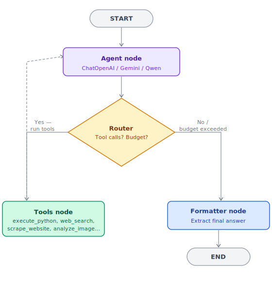

# 🤖 GAIA Benchmark Agent

[](https://huggingface.co/spaces/zxpr27/gaia-agent)
[](https://huggingface.co/spaces/zxpr27/gaia-agent)
[](https://github.com/langchain-ai/langgraphjs)
[](#model-pool)

A multi-step reasoning agent built to solve [GAIA benchmark](https://huggingface.co/datasets/gaia-benchmark/GAIA) questions. Powered by **LangGraph JS** for structured graph orchestration, it combines a dynamic pool of frontier LLMs with a rich tool suite — covering web search, code execution, image analysis, video parsing, and more.

---

## Table of Contents

- [Architecture](#architecture)
- [How It Works](#how-it-works)
- [Model Pool](#model-pool)
- [Tool Suite](#tool-suite)
- [Benchmark Results](#benchmark-results)
- [Setup](#setup)
- [Docker Deployment](#docker-deployment)

---

## Architecture

The agent runs as a stateful cyclic graph using LangGraph. It reasons, calls tools, stores results, and refines its approach in a continuous loop — until the question is resolved or the computation budget is exhausted.

<p align="center">
  
</p>

---

## How It Works

1. **State initialization** — The graph is seeded with the question, run parameters, and any file attachments.

2. **Agent node** — Selects the best LLM from the pool based on task characteristics (e.g. Gemini for multimodal inputs). Returns tool calls or a direct response.

3. **Router** — Decides what happens next:
   - Tool calls requested + budget under 6 rounds → Tools node
   - No tool calls, or budget exceeded → Formatter node

4. **Tools node** — Executes all requested tools in parallel, clamps outputs to protect context window size, then appends results to the conversation and loops back to the Agent.

5. **Formatter node** — Extracts and standardizes the final answer to match the strict format required by the GAIA evaluation system.

---

## Model Pool

The agent manages a dynamic LLM pool to maximize availability and route around rate limits. If a model returns a `429` error, the graph automatically falls back to the next model in the pool.

| Model | Role |
|---|---|
| Gemini 2.5 Flash | Primary — multimodal tasks (images, YouTube) |
| GPT-4o (via GitHub Models) | Primary — text-based reasoning |
| Qwen-2.5-72B-Instruct (via HF API) | Fallback — complex tool-use scenarios |
| Llama 3 (via Groq) | Fast backup reasoning node |

---

## Tool Suite

| Tool | Description |
|---|---|
| 🐍 `execute_python` | Sandboxed Python execution. Pre-loaded with `pdfplumber`, `openpyxl`, `pandas`, `pillow`, `beautifulsoup4`, and `duckduckgo-search`. |
| 🔍 `web_search` | Gemini Google Search Grounding for verified results; DuckDuckGo API as fallback. |
| 🌐 `scrape_website` | Converts URLs to clean markdown via Firecrawl, with a basic requests-based fallback. |
| 📼 `wayback_machine` | Retrieves historical page snapshots from `archive.org` for time-sensitive questions. |
| 📺 `yt_transcript` | Fetches YouTube transcripts and metadata via `yt-dlp` or Gemini's audio-visual processing. |
| 🖼️ `analyze_image` | Multimodal image analysis (Gemini 2.5 Flash, GPT-4o, Qwen2-VL) for charts, maps, diagrams, and chess positions. |
| 🤗 `huggingface_hub` | Queries the HF Hub API for model cards, dataset metadata, and download stats. |

---

## Benchmark Results

Evaluated on the GAIA validation set with exact-match scoring hosted by the Hugging Face Agents Course.

| Metric | Value |
|---|---|
| Total tasks attempted | 20 |
| Correct answers | 7 |
| Accuracy | **35.00%** |
| Evaluation level | Level-1 / Level-2 |
| Framework version | LangGraph JS v1.3.0 |

---

## Setup

### Prerequisites

- Node.js v18+
- Python 3 with `pip`

### Installation

```bash
git clone https://huggingface.co/spaces/zxpr27/gaia-agent
cd gaia-agent
npm install
```

### Environment Variables

Create a `.env` file in the project root:

```ini
GITHUB_TOKEN="your_github_token"
GOOGLE_API_KEY="your_gemini_api_key"
FIRECRAWL_API_KEY="your_firecrawl_key"
HF_TOKEN="your_hugging_face_token"
HF_USERNAME="your_hf_username"
```

### Running

```bash
# Test API connectivity
npm run test

# Run the solver
node src/index.js
```

---

## Docker Deployment

The space runs inside a Docker container on Hugging Face.

### Build and run locally

```bash
# Build
docker build -t gaia-agent .

# Run
docker run --env-file .env -p 7860:7860 gaia-agent
```
